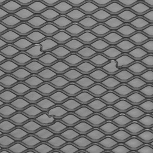
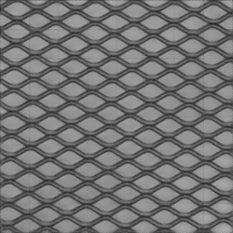
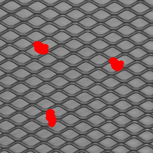

# AutoEncoder with SSIM loss

This is a third party implementation of the paper **Improving Unsupervised Defect Segmentation by Applying Structural Similarity to Autoencoders**.<br>


  


## Requirement
`tensorflow==2.2.0` <br>
`skimage` <br>

## Datasets
MVTec AD datasets https://www.mvtec.com/company/research/datasets/mvtec-ad/

## Code examples

### Step 1. Set the *DATASET_PATH* variable.

Set the [DATASET_PATH](options.py#L046) to the root path of the downloaded MVTec AD dataset.

### Step 2. Train **SSIM-AE** and Test.

- **bottle** object
```bash
python train.py --name bottle --loss ssim_loss --im_resize 266 --patch_size 256 --z_dim 500 --do_aug --p_rotate 0.
python test.py --name bottle --loss ssim_loss --im_resize 266 --patch_size 256 --z_dim 500 --bg_mask W
```
- **cable** object
```bash
python train.py --name cable --loss ssim_loss --im_resize 266 --patch_size 256 --z_dim 500 --do_aug --p_rotate 0. --p_horizonal_flip 0. --p_vertical_flip 0.
python test.py --name cable --loss ssim_loss --im_resize 266 --patch_size 256 --z_dim 500
``` 
- **capsule** object
```bash
python train.py --name capsule --loss ssim_loss --im_resize 266 --patch_size 256 --z_dim 500 --do_aug --p_rotate 0. --p_horizonal_flip 0. --p_vertical_flip 0.
python test.py --name capsule --loss ssim_loss --im_resize 266 --patch_size 256 --z_dim 500 --bg_mask W
```
- **carpet** texture
```bash
python train.py --name carpet --loss ssim_loss --im_resize 512 --patch_size 128 --z_dim 100 --do_aug --rotate_angle_vari 10
python test.py --name carpet --loss ssim_loss --im_resize 512 --patch_size 128 --z_dim 100
```
- **grid** texture
```bash
python train.py --name grid --loss ssim_loss --im_resize 256 --patch_size 128 --z_dim 100 --grayscale --do_aug 
python test.py --name grid --loss ssim_loss --im_resize 256 --patch_size 128 --z_dim 100 --grayscale
```
- **hazelnut** object
```bash
python train.py --name hazelnut --loss ssim_loss --im_resize 266 --patch_size 256 --z_dim 500 --do_aug --p_rotate_crop 0.
python test.py --name hazelnut --loss ssim_loss --im_resize 266 --patch_size 256 --z_dim 500 --bg_mask B 
```
- **leather** texture
```bash
python train.py --name leather --loss ssim_loss --im_resize 256 --patch_size 128 --z_dim 100 --do_aug
python test.py --name leather --loss ssim_loss --im_resize 256 --patch_size 128 --z_dim 100
```
- **metal_nut** object
```bash
python train.py --name metal_nut --loss ssim_loss --im_resize 266 --patch_size 256 --z_dim 500 --do_aug --p_rotate_crop 0. --p_horizonal_flip 0. --p_vertical_flip 0.
python test.py --name metal_nut --loss ssim_loss --im_resize 266 --patch_size 256 --z_dim 500 --bg_mask B 
```
- **pill** object
```bash
python train.py --name pill --loss ssim_loss --im_resize 266 --patch_size 256 --z_dim 500 --do_aug --p_rotate 0. --p_horizonal_flip 0. --p_vertical_flip 0.
python test.py --name pill --loss ssim_loss --im_resize 266 --patch_size 256 --z_dim 500 --bg_mask B
```
- **screw** object
```bash
python train.py --name screw --loss ssim_loss --im_resize 266 --patch_size 256 --z_dim 500 --grayscale --do_aug --p_rotate 0.
python test.py --name screw --loss ssim_loss --im_resize 266 --patch_size 256 --z_dim 500 --grayscale --bg_mask W
```
- **tile** texture
```bash
python train.py --name tile --loss ssim_loss --im_resize 256 --patch_size 128 --z_dim 100 --do_aug
python test.py --name tile --loss ssim_loss --im_resize 256 --patch_size 128 --z_dim 100
```
- **toothbrush** object
```bash
python train.py --name toothbrush --loss ssim_loss --im_resize 266 --patch_size 256 --z_dim 500 --do_aug --p_rotate 0. --p_vertical_flip 0.
python test.py --name toothbrush --loss ssim_loss --im_resize 266 --patch_size 256 --z_dim 500
```
- **transistor** object
```bash
python train.py --name transistor --loss ssim_loss --im_resize 266 --patch_size 256 --z_dim 500 --do_aug --p_rotate 0. --p_vertical_flip 0.
python test.py --name transistor --loss ssim_loss --im_resize 266 --patch_size 256 --z_dim 500 
```
- **wood** texture
```bash
python train.py --name wood --loss ssim_loss --im_resize 256 --patch_size 128 --z_dim 100 --do_aug --rotate_angle_vari 15
python test.py --name wood --loss ssim_loss --im_resize 256 --patch_size 128 --z_dim 100 
```
- **zipper** object
```bash
python train.py --name zipper --loss ssim_loss --im_resize 266 --patch_size 256 --z_dim 500 --grayscale --do_aug --p_rotate 0.
python test.py --name zipper --loss ssim_loss --im_resize 266 --patch_size 256 --z_dim 500 --grayscale 
```

## Overview of Results

**Classification**  
During test, I simply classify a test image as defect if there is any anomalous response on the residual map. It is strict for anomaly-free images, resulting in relatively lower accuracy in the `ok` column shown as below.<br>
Please note that the **threshold** makes a big difference to the outcome, which should be carefully selected.
<table>
<tbody>
<tr class="odd">
<td style="text-align: left;"></td>
<td style="text-align: left;">ok</td>
<td style="text-align: left;">nok</td>
<td style="text-align: left;">average</td>
</tr>
<tr class="even">
<td style="text-align: center;">bottle <span class="citation" data-cites="bottle"></span></td>
<td style="text-align: left;">90.0</td>
<td style="text-align: left;">98.4</td>
<td style="text-align: left;">96.4</td>
</tr>
<tr class="odd">
<td style="text-align: center;">cable <span class="citation" data-cites="cable"></span></td>
<td style="text-align: left;">0.0</td>
<td style="text-align: left;">45.7</td>
<td style="text-align: left;">28.0</td>
</tr>
<tr class="even">
<td style="text-align: center;">capsule <span class="citation" data-cites="capsule"></span></td>
<td style="text-align: left;">34.8</td>
<td style="text-align: left;">89.6</td>
<td style="text-align: left;">78.0</td>
</tr>
<tr class="odd">
<td style="text-align: center;">carpet <span class="citation" data-cites="carpet"></span></td>
<td style="text-align: left;">42.9</td>
<td style="text-align: left;">98.9</td>
<td style="text-align: left;">88.9</td>
</tr>
<tr class="even">
<td style="text-align: center;">grid <span class="citation" data-cites="grid"></span></td>
<td style="text-align: left;">100</td>
<td style="text-align: left;">94.7</td>
<td style="text-align: left;">96.2</td>
</tr>
<tr class="odd">
<td style="text-align: center;">hazelnut <span class="citation" data-cites="hazelnut"></span></td>
<td style="text-align: left;">55.0</td>
<td style="text-align: left;">98.6</td>
<td style="text-align: left;">82.7</td>
</tr>
<tr class="even">
<td style="text-align: center;">leather <span class="citation" data-cites="leather"></span></td>
<td style="text-align: left;">71.9</td>
<td style="text-align: left;">92.4</td>
<td style="text-align: left;">87.1</td>
</tr>
<tr class="odd">
<td style="text-align: center;">metal nut <span class="citation" data-cites="metal nut"></span></td>
<td style="text-align: left;">22.7</td>
<td style="text-align: left;">67.7</td>
<td style="text-align: left;">59.1</td>
</tr>
<tr class="even">
<td style="text-align: center;">pill <span class="citation" data-cites="pill"></span></td>
<td style="text-align: left;">11.5</td>
<td style="text-align: left;">75.9</td>
<td style="text-align: left;">65.9</td>
</tr>
<tr class="odd">
<td style="text-align: center;">screw <span class="citation" data-cites="screw"></span></td>
<td style="text-align: left;">0.5</td>
<td style="text-align: left;">90.0</td>
<td style="text-align: left;">68.1</td>
</tr>
<tr class="even">
<td style="text-align: center;">tile <span class="citation" data-cites="tile"></span></td>
<td style="text-align: left;">100.0</td>
<td style="text-align: left;">3.6</td>
<td style="text-align: left;">30.8</td>
</tr>
<tr class="odd">
<td style="text-align: center;">toothbrush <span class="citation" data-cites="toothbrush"></span></td>
<td style="text-align: left;">83.3</td>
<td style="text-align: left;">100</td>
<td style="text-align: left;">95.2</td>
</tr>
<tr class="even">
<td style="text-align: center;">transistor <span class="citation" data-cites="transistor"></span></td>
<td style="text-align: left;">23.3</td>
<td style="text-align: left;">97.5</td>
<td style="text-align: left;">53.0</td>
</tr>
<tr class="odd">
<td style="text-align: center;">wood <span class="citation" data-cites="wood"></span></td>
<td style="text-align: left;">89.5</td>
<td style="text-align: left;">76.7</td>
<td style="text-align: left;">79.7</td>
</tr>
<tr class="even">
<td style="text-align: center;">zipper <span class="citation" data-cites="zipper"></span></td>
<td style="text-align: left;">68.8</td>
<td style="text-align: left;">81.5</td>
<td style="text-align: left;">78.8</td>
</tr>
</tbody>
</table>
*SSIM loss, 200 epochs, different threshold

## Discussion
- **SSIM + L1 metrics**<br>
Since SSIM is a measure of similarity only between grayscale images, it cannot handle color defect in some cases. So here I use SSIM + L1 distance for anomaly segmentation.
- **VAE**<br>
I have tried VAE, observing no performances improvements.
- **InstanceNorm**<br>
I have also tried adding the IN layer for accelerating convergence, but the droplet artifact appears in some cases. It is also mentioned and discussed in **StyleGAN-2** paper. 

## Supplementary materials
My notes https://www.yuque.com/books/share/8c7613f7-7571-4bfa-865a-689de3763c59?#
password `ixgg`

## References
@inproceedings{inproceedings,
author = {Bergmann, Paul and Löwe, Sindy and Fauser, Michael and Sattlegger, David and Steger, Carsten},
year = {2019},
month = {01},
pages = {372-380},
title = {Improving Unsupervised Defect Segmentation by Applying Structural Similarity to Autoencoders},
doi = {10.5220/0007364503720380}
}

Paul Bergmann, Michael Fauser, David Sattlegger, Carsten Steger. MVTec AD - A Comprehensive Real-World Dataset for Unsupervised Anomaly Detection; in: IEEE Conference on Computer Vision and Pattern Recognition (CVPR), June 2019


